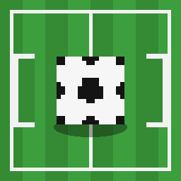

# ⚽ Futebol 3D — Mod para Minecraft Bedrock (1.26.44)

Um mod completo de futebol para **Minecraft Bedrock Edition 1.26.44** (26.44):
bola 3D animada com física própria, campo construído automaticamente, partidas com
cronômetro, placar persistente, times, estatísticas, **HAT-TRICK** com fanfarra e
troféu, menu gráfico, sons e efeitos — tudo controlado por comandos de chat.



## 📦 Instalação

1. Baixe o arquivo `packs/futebol-3d.mcaddon`.
2. Toque/abra o arquivo — o Minecraft abre e importa os dois packs (Behavior + Resource).
3. **Novo mundo:** crie um mundo e ative em *Packs de Comportamento* e *Packs de Recursos*:
   `⚽ Futebol 3D — Behavior Pack` e `⚽ Futebol 3D — Resource Pack`.
   **Mundo existente:** Gerenciador de Pacotes do mundo → ative os dois packs → aplicar.
4. Entre no mundo, ande até um terreno plano e digite:

```
/fute ajuda
```

> Requer Minecraft Bedrock **1.26.44** (ou superior). O script usa as APIs oficiais
> `@minecraft/server` 2.10.0-beta.1.26.44-stable e `@minecraft/server-ui`
> 2.2.0-beta.1.26.44-stable.

## 🎮 Como jogar

| Ação | Como fazer |
|---|---|
| Ganhar uma bola | `/fute bola` (ou menu ⚽) |
| **Jogar a bola** | Clique direito com a bola na mão |
| **Chutar a bola** | Dar **soco na bola** (andar = chute fraco, **correr/sprint = chute forte** com rastro de luz) |
| **Pegar a bola** | Clique direito na bola (mão livre) |
| Defender | O corpo bloqueia e desvia a bola (contenção de bola) |
| Marcar gol | Atravesse a linha entre os postes (abaixo da trave) |

O gol tem **rede de vidro**: a bola entra, quica na rede e volta ao centro após a comemoração.

## 🏟️ Comandos

Todos sem precisar de op/nível de operador (permisão `Any`):

| Comando | O que faz |
|---|---|
| `/fute ajuda` | Lista os comandos e instruções |
| `/fute menu` | Menu gráfico completo (formulário) |
| `/fute campo` | Constrói o campo (44×28) onde você estiver, com gols, rede, áreas e bandeirinhas |
| `/fute campo apagar` | Remove o campo |
| `/fute inicio [min]` | Inicia a partida (padrão 10 min, máx. 120) — times vazios são preenchidos automaticamente |
| `/fute pausa` / `/fute continua` | Pausa / retoma o cronômetro |
| `/fute fim` | Encerra a partida e anuncia o resultado |
| `/fute time azul` / `/fute time vermelho` / `/fute time sair` | Entra / sai de time |
| `/fute times` | Lista os times |
| `/fute bola` | Recebe uma bola (item único) |
| `/fute apagar` | Remove todas as bolas do campo |
| `/fute placar` | Mostra o placar e o tempo restante |
| `/fute stats` | Estatísticas por jogador (gols, chutes) + artilheiro |
| `/fute hat` | Lista de hat-tricks |
| `/fute reset` | Zera placar, estatísticas e hat-tricks |

O alias `/futebol` também funciona, e os comandos aceitam digitação por chat sem barra
(ex.: `fute inicio 15` no chat).

## ✨ Funções (o "monte de funções")

- ⚽ **Bola 3D de verdade**: entidade customizada com cubo animado girando, gravidade,
  quique com restituição, atrito, ar, teto, desvio ao bater em jogadores e limites de velocidade.
- 🏟️ **Campo automático**: gramado com faixas de linhas, círculo central, grandes áreas,
  marca do pênalti, gols com postes, trave e **rede de vidro** que segura a bola.
- 🥅 **Detecção de gol física**: a linha do gol só vale entre os postes e abaixo da trave;
  a bola precisa *atravessar* a linha na direção do gol (sem gol fantasma na rede).
- ⏱ **Partidas com cronômetro**: tempo configurável, aviso do último minuto,
  pausa/retomada, fim de jogo automático com anúncio do vencedor.
- 🎩 **HAT-TRICK**: 3 gols → banner, fanfarra, fogos de artifício, corações e partículas;
  **Troféu de Hat-Trick** (item com glint dourado) no 1º hat-trick; 6 gols = "dois hat-tricks"!
- 👕 **Times Azul e Vermelho**: manuais ou auto-atribuídos equilibrados no início.
- 🏆 **Placar persistente** no placar de lateral (scoreboard vanilla) + placar na actionbar
  atualizado todo segundo com o tempo restante.
- 📊 **Estatísticas persistentes** por jogador: gols, chutes, artilheiro, hat-tricks
  (sobrevivem ao reinício do servidor — tudo em *dynamic properties*).
- 🎬 **Comemoração de gol**: "GOOOL!" na tela, torcida, apito, fogos, totem e endrod particles,
  bola volta ao centro sozinha depois de 12 s.
- 🔊 **Pack de sons 100% sintetizado no mod**: chute (fraco/forte), quique, pegar, apito,
  gol, fanfarra de hat-trick, torcida ao fundo e fim de jogo.
-  **Chute forte**: chute sprintado mais veloz + rastro de partículas brilhantes.
- 🧱 **Campo removível** sem estragar a construção original (só remove blocos do mod).
- 📱 **Menu por formulário** (`/fute menu`) — funciona em console e mobile.
- ️ **Bolas com descarte automático** (paradas por 2 min) e limite de 8 bolas.
- 💾 **Estado salvo**: partida em andamento é restaurada se o servidor cair (com aviso).
- ⚠️ **Robusto**: todo efeito/som/entidade opcional é protegido contra erros — nada derruba o mundo.

## 🧩 Como a bola 3D funciona

- `futebol:bola` é uma **entidade custom** (behavior pack) sem física vanilla
  (`minecraft:physics: false`) — o script controla cada tick (20 Hz): gravidade,
  colisão com blocos por eixo (quique/parede/teto), atrito no chão e desvio por jogadores.
- O resource pack define o **modelo 3D** (`models/entity/bola.geo.json`), a
  **textura** clássica da bola e a **animação de giro** (`animations/bola.anim.json`),
  aplicada via `client_entity` — a bola gira continuamente enquanto voa.

## 🛠️ Desenvolvimento

```
minecraft/
├── packs/futebol-3d.mcaddon      ← instalável (zip dos dois packs)
├── src/
│   ├── behavior/                 ← Behavior Pack
│   │   ├── manifest.json
│   │   ├── entities/bola.json    ← entidade da bola
│   │   ├── items/bola.json       ← item da bola
│   │   ├── items/trofeu.json     ← troféu de hat-trick
│   │   └── scripts/
│   │       ├── main.js           ← jogo (física, eventos, comandos, UI)
│   │       └── core.js           ← lógica pura (testável em Node)
│   └── resource/                 ← Resource Pack
│       ├── entity/bola.client.json, animations/, models/, textures/, sounds/
│       └── sounds.json
└── tools/
    ├── lib-png.js                ← gerador de PNG sem dependências
    ├── gen-textures.js           ← gera texturas (node tools/gen-textures.js)
    ├── gen-audio.js              ← sintetiza os sons WAV (node tools/gen-audio.js)
    ├── build.js                  ← gera o .mcaddon (node tools/build.js)
    └── test-core.js              ← testes de unidade (node tools/test-core.js)
```

Rebuild após editar:

```bash
node minecraft/tools/gen-textures.js   # opcional (texturas)
node minecraft/tools/gen-audio.js      # opcional (sons)
node minecraft/tools/test-core.js      # testes
node minecraft/tools/build.js          # gera packs/futebol-3d.mcaddon
```

Para tipar/checkar as APIs, os modules oficiais estão em `devDependencies`
(`@minecraft/server`, `@minecraft/server-ui`) — versões pinadas para 1.26.44.

## 📄 Licença

MIT — use, modifique e distribua à vontade.
